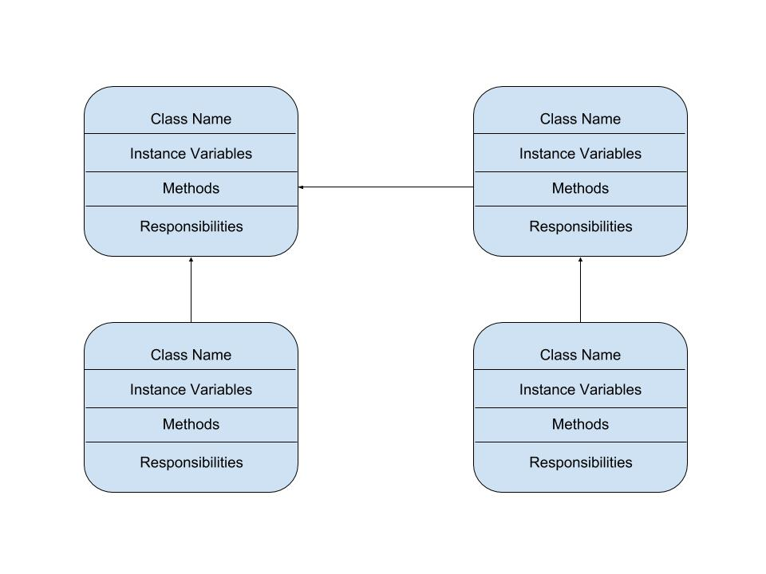

:warning: Everything between << >> needs to be replaced

# Math Around World
## CS 110 Final Project
### Summer 2019
### [Assignment Description](https://docs.google.com/document/d/1d6wcXns0hz7HcUr4yF_tJK3QBx3daybmJO3dREPxABA/edit?usp=sharing)

https://github.com/binghamtonuniversity-cs110/final-project-sum19-joke
<< [link to demo presentation slides](#) >>

### Team: JOKe
#### Kimberly Meeker kmeeker2@binghamton.edu
#### Jae Kim jkim614@binghamton.edu
#### Yuqiao Huang yhuan171@binghamton.edu

***

## Project Description
(tentative) This is a math game called 'Math Around World.' In this game, you will see math problems with increasing difficulties. Hurry up! They are dropping down! Do not let the problems touch the ground or else you lose the game. You will also have a chance to interact with cultural elements like British, China, India, etc.

***    

## User Interface Design
* A wireframe or drawing of the user interface concept along with a short description of the interface. You should have one for each screen in your program.
    * For example, if your program has a start screen, game screen, and game over screen, you should include a wireframe / screenshot / drawing of each one and a short description of the components
    * You should also have a screenshot of your final GUI

***        

## Program Design
* You should have a list of any additional libraries or modules used (pygame, request) beyond non-standard python.
    * For each additional module you should include
        * url for the module documentation
        * a short description of the module
* Decide upon a class interface for the classes in your project.
    * A simple drawing that shows the class relationships in your code (see the sample Proposal document for an example). 
    * This does not need to be overly detailed, but should show how your code fits into the Model/View/Controller paradigm.
* You should have a list of each of your classes with a description.

***

## Tasks and Responsibilities
* You must outline the team member roles and who was responsible for each class/method, both individual and collaborative.

### Software Lead - Yuqiao Huang (tentative)

<< Worked as integration specialist by... >>

### Front End Specialist - Jae Kim (tentative)

<< Front-end lead conducted significant research on... >>

### Back End Specialist - Kimberly Meeker (tentative)

<< The back end specialist... >>

## Testing
* Describe your testing strategy for your project.
    * Example

### Menu Testing

<< describe testing methods >>

### Game Testing

<< describe testing methods >>

* A copy of your ATP

| Step                  | Procedure     | Expected Results  | Actual Results |
| ----------------------|:-------------:| -----------------:| -------------- |
|  1  | Run Counter Program  | GUI window appears with count = 0  |          |
|  2  | click count button  | display changes to count = 1 |                 |
etc...
